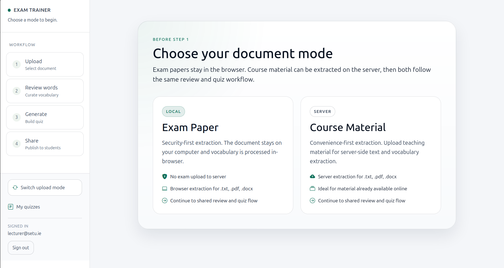
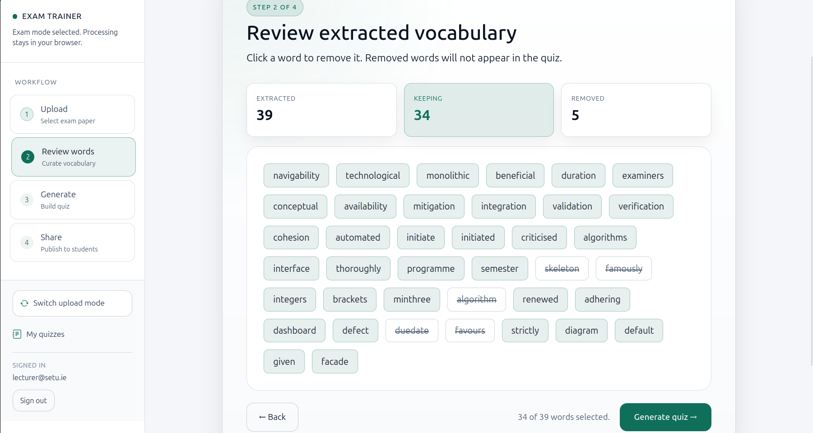
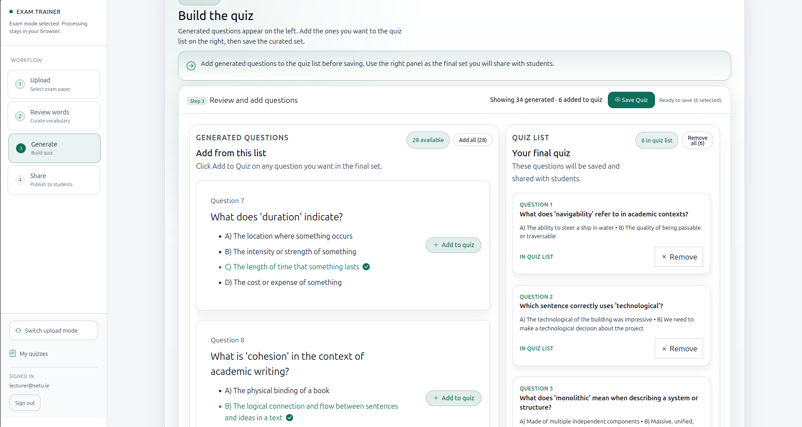
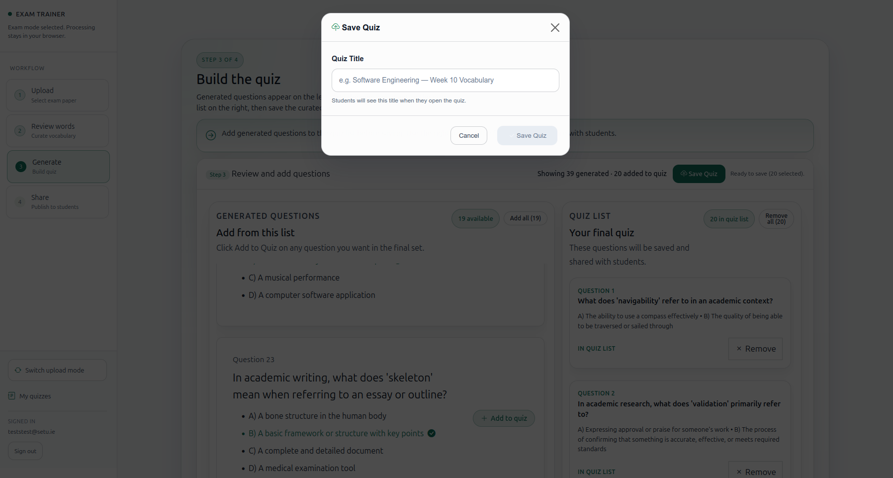
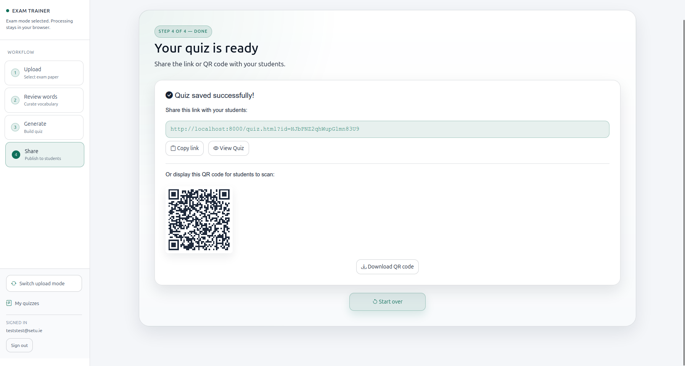

# Exam Language Trainer

[](LICENSE)
[](https://firebase.google.com/)
[](https://developer.mozilla.org/)

Exam Language Trainer helps lecturers turn exam papers or course material into vocabulary quizzes for students studying in a non-native language. The lecturer workflow keeps exam-paper processing local to the browser, while approved quizzes can be shared with students through a simple web link or QR code.

The project now has a public app-store style overview at [src/landing.html](src/landing.html) that shows the product flow, screenshots, FAQs, and contact details.

## What It Does

- Extracts unusual or difficult vocabulary from uploaded material.
- Lets lecturers review, curate, and generate multiple-choice questions.
- Publishes approved quizzes for students without requiring student accounts.
- Keeps exam-paper processing browser-local in exam mode to protect confidentiality.

## Product Areas

- Lecturer app in [src/js/main.js](src/js/main.js): sign-in, upload, extraction, curation, generation, save, and share.
- Student quiz app in [src/js/quiz.js](src/js/quiz.js): load a quiz, answer questions, and review results.
- Quiz management app in [src/js/manage.js](src/js/manage.js): list, share, and delete saved quizzes.
- Cloud functions in [functions/index.js](functions/index.js): server-side vocabulary extraction and quiz generation APIs.

## Screenshots

The public landing page highlights the main product flows and uses screenshots from [src/assets/screenshots/](src/assets/screenshots/).







## Stack

- Vanilla JavaScript with ES modules
- Firebase Hosting, Functions, and Firestore
- Compromise.js for vocabulary extraction support
- Stopword lists and custom scoring heuristics for candidate ranking

## Getting Started

Install dependencies in the root project and in the Functions folder:

```bash
npm install
cd functions
npm install
```

To run the static frontend, serve the `src/` directory with any local HTTP server.

To run the backend locally with Firebase emulators:

```bash
firebase emulators:start --only functions,firestore
```

In another terminal, run the API smoke test:

```bash
npm run smoke:api
```

## Security Notes

- Exam paper processing stays local in exam mode.
- Approved quizzes are the only data published to students.
- Firestore authorization rules are defined in [firestore.rules](firestore.rules).
- Rate limiting is backed by Firestore, with an in-memory fallback if the database is temporarily unavailable.

## Repository Structure

- [src/](src) - public frontend, landing page, and client-side app code.
- [functions/](functions) - Firebase Cloud Functions for API endpoints.
- [firestore.rules](firestore.rules) - Firestore security rules.
- [RELEASE-CHECKLIST.md](RELEASE-CHECKLIST.md) - deployment and verification checklist.
- [vision-document.md](vision-document.md) - original product framing and problem statement.

## Verification

- Check the lecturer flow end to end in the browser.
- Check the student quiz flow with a shared link.
- Run the smoke API script against local emulators or the deployed endpoint.
- Confirm the landing page assets load from the Firebase Hosting root.

## Contact

- Email: tomradulescu@proton.me
- GitHub: [ashdorm0/exam-language-trainer](https://github.com/ashdorm0/exam-language-trainer)

For deployment steps, see [RELEASE-CHECKLIST.md](RELEASE-CHECKLIST.md).