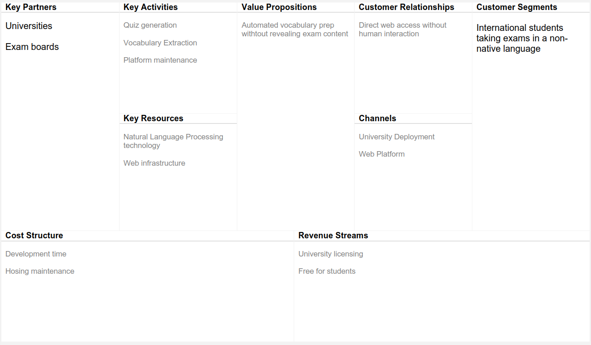

# Exam Language Trainer Vision

## Introduction
I want to create a web application that lecturers can use to help foreign students who are studying in their non-native language.
This will be a great help for lecturers and students 
This will help lecturers identify who is struggling with the language and can help struggling/anxious students feel more prepared as they take their exam
This will be achieved by creating a web-based application that extracts unusual/difficult words and generate a multiple choice quiz based on those words to test their vocabulary knowledge. This obviously should not include words that reveal too much information about the exam i.e protein names appearing on a biology exam and context should be kept in mind i.e a software development student should know what algorithm is 
This goal should be achievable without compromising exam integrity and security should be a main concern.
In a heavily globalized world I believe this will help more students be more confident and do better on their exams. As a foreign student myself, I genuinely believe this product could have helped me a number of times.

## Business Model Canvas

## Business Case Summary 
The problem is international students taking exams in a non-native language can mask their actual subject knowledge and some might fail not due to not knowing the material but because they are struggling with understanding specific vocabulary, and this creates feelings of unfairness and anxiety in some students.
And this matters even more today as universities around the world are becoming more and more internationalized, as more students have the chance to go study abroad with myself being a prime example.
The ones who care about these the most should be the universities themselves as they should provide a fair assessment for everyone, as exam integrity is one of the main concerns. 
And this proposition has good value because it helps students each begin at the same understanding of the language, reduces student anxiety and maintains exam security all at a low cost 

## Stakeholders
The stakeholder of this product are the lecturers and the foreign students.
The lecturer's goals are to make sure that all students are at least at the same starting point, understanding the language before the subject of the course.
This should matter to a lecturer because they cannot evaluate the level of a certain course if they are not sure if what the students don't understand is the course matter or the actual language itself.
The foreign students goals are to not only learn a new language but also learn a potential difficult subject in that new language. As a student, it is their responsibility to prepare for an exam adequately, but as a foreign student that can be harder with the existence of words that maybe they have not seen before and are not familiar with despite their language level and with a simple remainder before an exam, it can help certain students improve their results.

## Software Overview
The system will be made of three parts. 
- Client side tool which runs in the lecturers browser, processes the exam documents and generates the quiz locally 
- Storage/cloud application that stores the approved quizzes
- Web based student interface where the students can access and take quizzes.

This three part system will be essential for exam security as the lecturer will never upload the document to the internet where someone could access it.
It should be a simple tool to use for both lecturers and students.
The lecturers would load the exam, after which the browser runs processes the exam by extracting a number of difficult words and then generates a vocabulary quiz after which the lecturer approves the quiz and uploads it to a server.
The student will be given the quiz a few days in advance to help them prepare.

## Summary of Software Features
The Exam Language Trainer provides the following key features for both lecturers and students 

- **Document Processing**: Lecturers load exam paper into their browser in one of the approved formats.
- **Vocabulary Extraction**: The system identifies and extracts difficult or unusual words from the loaded exam papers
- **Quiz generation**: Multiple-choice quizzes are generated based on the extracted words, which have to be approved by a lecturer
- **Quiz Access**: Students access approved quizzes via the web platform without having access or viewing any of the exam papers
- **Result tracking and reviewing**: Students can track and review the results of the vocabulary quiz
- **Security**: To emphasise exam confidentiality, security is one of the main concerns of the systems to maintain exam integrity. This happens by creating a two part system where all the processing done on the exam paper happens client side and only the approved quizzes are uploaded to the server

## Main Risk summary 

### Business risks
One of the main business risk would be if the students and/or the lecturers are open to this idea while the other would be the already established competitors in the market
### Technological risks
- can the processing be done in the lecturers browser?
- can any kind of files be processed in the browser? can it be done?
- what defines a hard word?
### Project risks
- time constraints, 15 weeks may not be enough time to build a whole system
- technical constrains, learning about language processing as the project progresses

## Competitors
There are several platforms online that can generate quizzes based on uploaded file. They mostly focus on creating notes or quizzes based on the uploaded content rather than specifically focusing on non-native speakers students.
Apart from that, they all require uploading a document so the safety that is of utmost importance in the academic field is compromised.
Some of the competitors i have found are
- Jotform which is a purely AI based website where you can upload your own already made quiz or choose a template and the AI will generate a quiz. They are mostly a form generator i.e Order forms, Registration forms, Booking forms etc.
- Acequiz AI lets you upload a image or PDF file than input a prompt on about the quiz. And they require you create an account and only the first five quizzes are free.
From my research most of the tools function in the same way, they use AI API to create a quiz based on a prompt, using the uploaded file as context.
So a gap is present in the market that can be filled by this project which combines vocabulary extraction for students learning a new language with secure, client-side processing of confidential materials.

## References 

- www.jotform.com. (n.d.). Free Online Form Builder & Form Creator | JotForm. [online] Available at: https://www.jotform.com/.

- Acequiz.ai. (2024). Free AI Quiz Generator: PDF to Quiz Online. [online] Available at: https://acequiz.ai/ [Accessed 21 Jan. 2026].

‌
‌